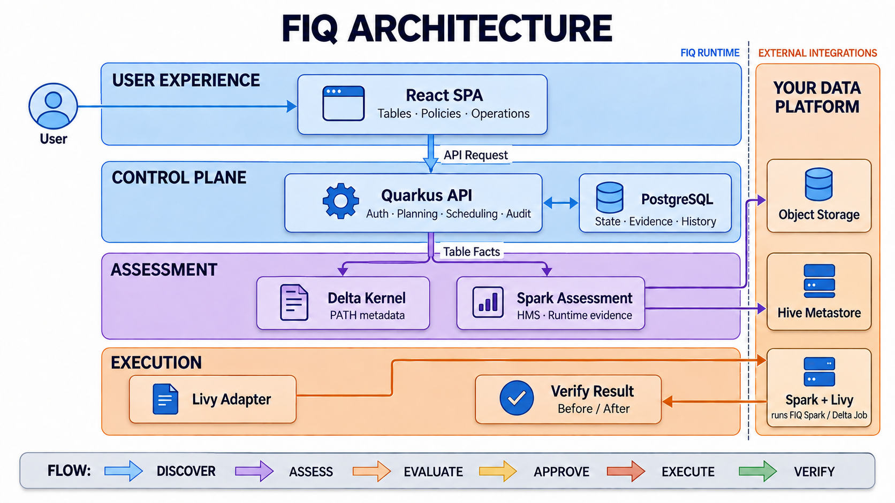

# FIQ

FIQ is a maintenance control plane for Classic Delta Lake tables. It sits between a data
platform team and the Spark jobs that compact files or remove expired data, so maintenance does
not have to live in scattered scripts and tribal knowledge.

The project is built around a simple loop:

```text
DISCOVER → ASSESS → EVALUATE → APPROVE → EXECUTE → VERIFY
```

FIQ discovers PATH and Hive Metastore tables, records table facts independently from policy,
explains why a table does or does not qualify, runs approved work through Livy, and checks the
table again before declaring success. It never edits `_delta_log` directly.

## Where the project is today

The honest version: the Phase 1 flow works, but FIQ is not production-ready yet.

The full happy path works on the runtime we currently qualify: Spark 4.0.1, Delta Lake 4.0.1,
Scala 2.13, and Livy. Both PATH and Hive Metastore discovery are implemented. The two executable
maintenance operations are `OPTIMIZE BINPACK` and `VACUUM FULL`, including preflight evidence,
approval, structured job results, and before/after verification.

That is enough to run the local demo, connect a controlled Delta environment, and try the workflow
with a small platform team. It is not enough to run FIQ as a shared service for untrusted tenants.
Multi-workspace isolation, crash-safe submission and cancellation, fully transactional audit
history, large-fleet behavior, HA/DR, and broader security qualification still need work. For now,
keep it inside a trusted environment and start with non-critical tables.

The exact implemented and deferred boundaries are tracked in
[`docs/phase-status.md`](docs/phase-status.md).

## Architecture



FIQ itself is deliberately small: the React UI is served by the Quarkus application, and
PostgreSQL stores control-plane state, evidence, and operation history. Delta Kernel is embedded
for PATH metadata reads. Spark supplies HMS/runtime evidence and performs maintenance through the
Livy adapter.

Object storage, Hive Metastore, Spark, and Livy belong to the user's data platform. They are not
startup dependencies of the minimal FIQ runtime. The repository includes them only in the demo
overlay so the workflow can be tried without an existing lakehouse.

Read [`docs/architecture.md`](docs/architecture.md) for module boundaries, execution flow, and the
places where the current implementation is intentionally conservative.

## Try it locally

The demo is the quickest way to understand the product because it starts FIQ together with
MinIO, Hive Metastore, Spark/Delta, Livy, and disposable sample tables.

### Requirements

- Docker with Docker Compose
- Java 21
- `curl` and `jq` if you want to run the acceptance flow
- Enough time and bandwidth for the first Spark/Hive dependency download

### 1. Clone and start

```bash
git clone https://github.com/quocvinhx2101-ctrl/Fiq.git
cd Fiq
make demo-up
```

The first start can take several minutes. Check the containers with:

```bash
make demo-ps
```

`server`, `postgres`, `minio`, `hms-postgres`, `hms`, and `livy` should be running.
`minio-init` and `sample-init` should finish with `Exited (0)`; they are one-shot setup jobs.

### 2. Open FIQ

Open <http://localhost:9091>. The demo creates its PATH and HMS connections and discovers the
sample tables automatically.

Use the UI in this order:

1. Open **Connections** and test the PATH or HMS connection.
2. Open **Tables**, choose a sample table, and refresh its assessment.
3. Create an `OPTIMIZE BINPACK` or `VACUUM FULL` policy under **Policies**.
4. Create a plan from the table's **Policies** tab and read the decision evidence.
5. Approve or queue the plan under **Operations**.
6. After it finishes, compare the before/after evidence instead of trusting Spark exit status
   alone.

To run the executable acceptance flow against the demo fixtures:

```bash
make demo-test
```

This mutates only tables marked as demo samples. Do not point
`scripts/acceptance-core.sh` at real tables.

### 3. Stop or reset the demo

```bash
make demo-down
```

This stops the containers and keeps their volumes. To erase only the demo data and start clean:

```bash
make demo-reset
make demo-up
```

## Run only FIQ

If you already operate object storage, Spark 4.0.1, Delta 4.0.1, Livy, and optionally Hive
Metastore, start the minimal runtime:

```bash
make up
```

This starts only `fiq-server` and PostgreSQL. Open <http://localhost:9091>; an empty
**Connections** page is the expected first state.

Before creating a connection, publish the built Spark job somewhere every Livy driver can read:

```bash
make build
```

The artifact is created at:

```text
fiq-spark-job/build/libs/fiq-spark-job-0.1.0-SNAPSHOT-all.jar
```

You will also need a bounded Delta root or HMS catalog, a Livy endpoint, a result prefix writable
by Spark and readable by FIQ, and storage credentials supplied through the runtime environment.
The complete setup, including S3-compatible variables and Spark configuration, is in
[`docs/end-user-guide.md`](docs/end-user-guide.md).

Useful runtime commands:

```bash
make ps
make logs
make down
```

## What is implemented

- Bounded PATH discovery and Spark-backed Hive Metastore discovery
- Six assessment dimensions: file layout, deletion vectors, transaction log, retention,
  clustering, and protocol
- Policy evaluation with structured decision evidence
- Manual approval and scheduled policy runs
- `OPTIMIZE BINPACK` and `VACUUM FULL`
- Planned Delta-version checks and fail-closed capability handling
- Structured Spark results with SHA-256 manifests
- Fresh post-operation assessment and before/after verification
- A React UI for connections, tables, policies, operations, and audit history

Not mutation-qualified in Phase 1: VACUUM LITE, Z-order, liquid-clustering maintenance, REORG,
inventory vacuum, Glue, Unity Catalog, other table formats, or Spark/Delta versions outside the
stated baseline.

## Repository layout

- `fiq-domain` — health, policy, capability, operation, and security model
- `fiq-delta` — Classic Delta metadata assessment
- `fiq-engine-spark` — Livy execution adapter
- `fiq-spark-job` — Spark/Delta maintenance application
- `fiq-server` — REST API, scheduler, persistence, authentication, and SPA hosting
- `fiq-ui` — React interface
- `docs` — operator, admin, architecture, upgrade, and end-user guides

## Build and test

```bash
make build
make test
```

For the full backend check:

```bash
./gradlew spotlessApply ci --no-daemon
```

For the UI:

```bash
cd fiq-ui
npm test
npm run build
```

Run `make help` for all runtime, demo, log, restart, and cleanup commands.

## Further reading

- [`docs/end-user-guide.md`](docs/end-user-guide.md) — demo and existing-platform setup
- [`docs/architecture.md`](docs/architecture.md) — runtime boundaries and operation flow
- [`docs/operator-guide.md`](docs/operator-guide.md) — day-to-day operation and recovery
- [`docs/admin-guide.md`](docs/admin-guide.md) — deployment and security settings
- [`docs/upgrade-guide.md`](docs/upgrade-guide.md) — upgrade procedure
- [`docs/phase-status.md`](docs/phase-status.md) — tested scope and known limits

## Acknowledgements

FIQ is an independent project inspired by [Floe](https://github.com/nssalian/floe), created by
[nssalian](https://github.com/nssalian). Floe's approach to table-maintenance control planes
provided important ideas and a practical foundation for FIQ's Delta Lake–focused design. We are
grateful to its author and contributors for making their work available to the open-source
community.

Where FIQ adapts material from Floe, that work remains acknowledged under the Apache License 2.0.
See [`NOTICE`](NOTICE) and [`LICENSE`](LICENSE) for attribution and licensing details. FIQ is not
affiliated with or endorsed by the Floe project.
